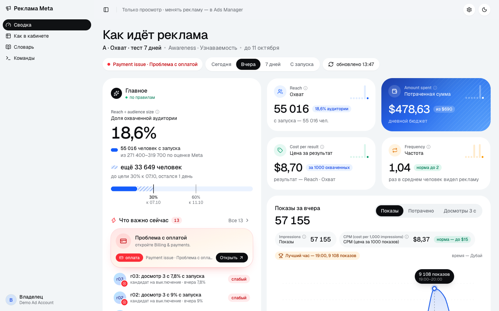
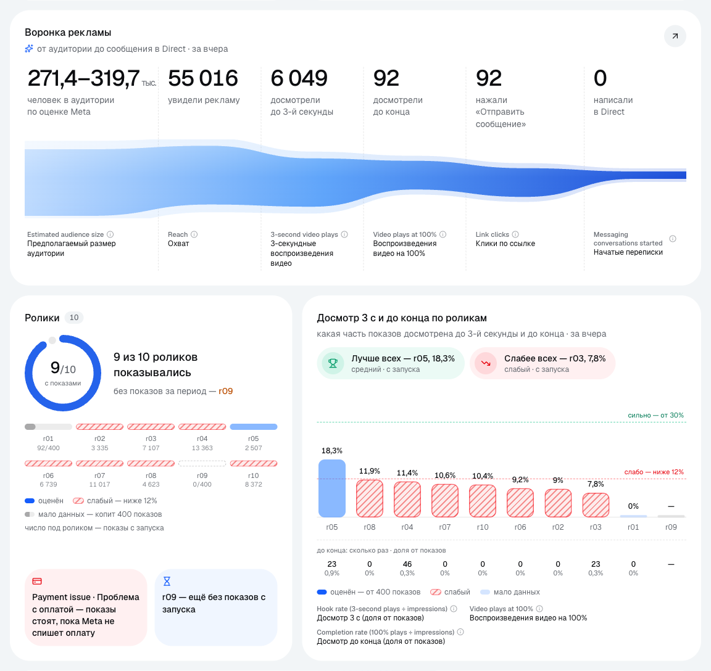
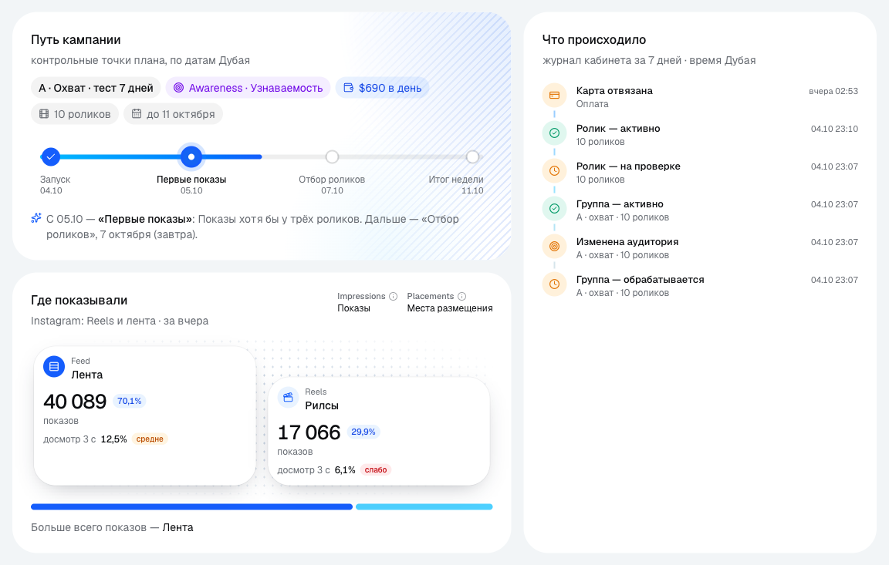
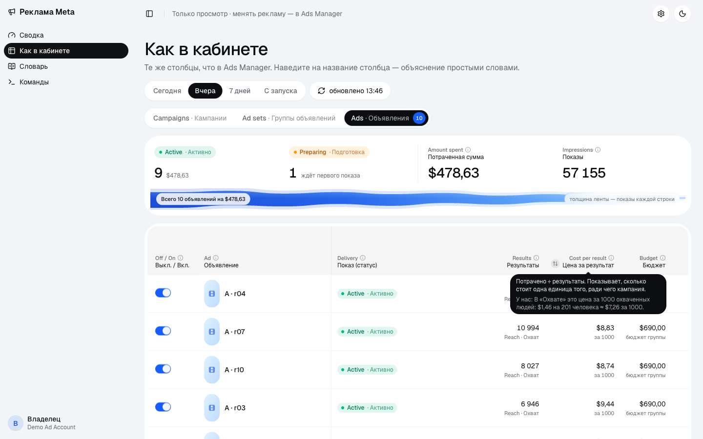
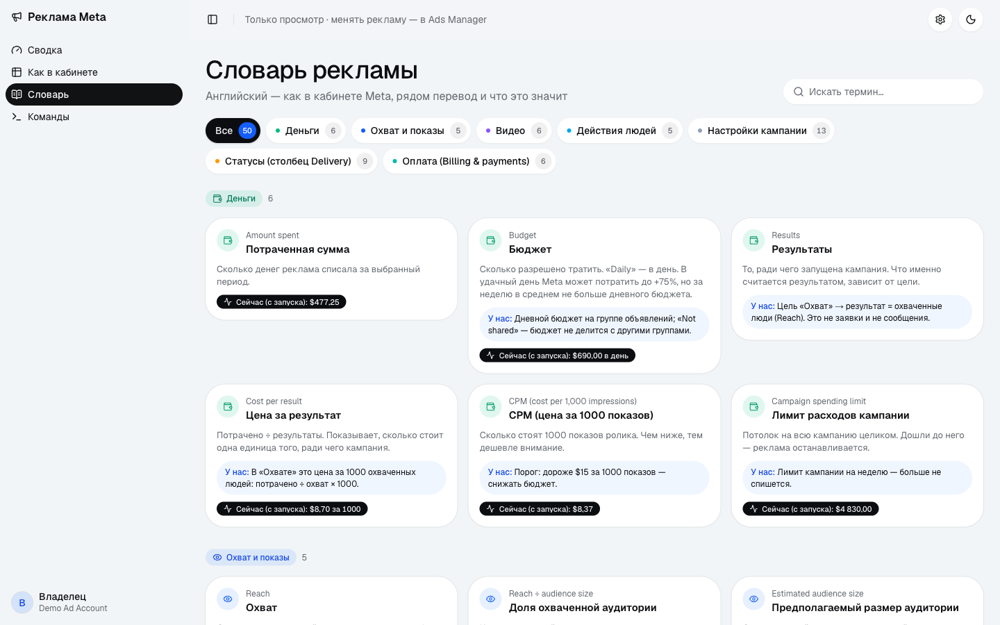
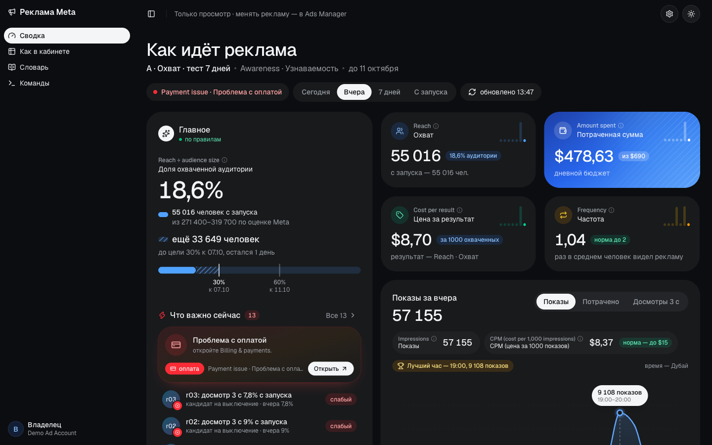
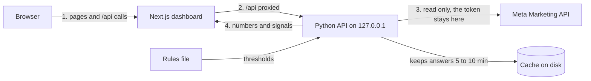

# Meta Ads dashboard

[](https://github.com/ahrimmedia-beep/meta-ads-dashboard/actions/workflows/ci.yml)

Dashboard for a Meta ad account that explains every metric in plain language. It shows spend, reach, cost per result and frequency for a chosen period, and puts what needs attention at the top. It only reads data. It never changes the ads.



## The problem

Ads Manager shows dozens of columns in ad jargon. A business owner who runs ads but does not work in Ads Manager every day cannot tell which number is bad or what to do about it. Ads Manager also does not say when a video has enough data to be judged, so a video can be turned off too early, after a few hundred views.

## What I built

- An overview page for a chosen period: today, yesterday, the last 7 days with today, or since launch. It has the key numbers, a chart by hour in Dubai time or by day, a funnel, hook rate and completion per video, and placements.
- A "What matters now" list, worst first. Payment problems go on top, then delivery, frequency, CPM, weak and strong videos, videos in review and the next control point.
- A table in the same shape as Ads Manager for campaigns, ad sets and ads, with sorting and totals. Each column keeps its English name from Ads Manager and adds a translation and a plain explanation on hover.
- A glossary of 50 Ads Manager terms. Many of them show their current value from the campaign.
- A commands page that runs a fixed list of read-only reports. Nothing on the dashboard can change the ads.
- A Python API that reads Meta, caches the answers and turns the numbers into signals by a rules file.

## Screenshots

The screenshots use demo data: made-up account, campaign and ad IDs, scaled numbers and example thresholds.

**Funnel and videos.** From the estimated audience to people who wrote in Direct. Each video gets a verdict only after enough impressions.



**Campaign path and account log.** Control points by date, placements and the account's own event log in Dubai time.



**Table in the shape of Ads Manager.** Same columns as Meta, with a translation and a plain explanation on hover.



**Glossary.** 50 Ads Manager terms, many with their current value from the campaign.



**Dark theme.**



## How it works



The browser talks only to Next.js. Next.js forwards `/api` to a small Python server that listens on 127.0.0.1 and holds the Meta token, so the token never reaches the browser.

Meta limits how often an ad account can be read. The server keeps most answers for 5 to 10 minutes and saves them to disk. A manual refresh reads Meta at most once a minute. When Meta hits that limit, the dashboard shows the last saved numbers with their time, and the server stops calling Meta for 10 minutes.

Thresholds live in a rules file: hook rate, frequency, CPM, the minimum impressions before a video is judged, reach targets by date and control points. A video gets a verdict only after enough impressions, and only on its hook rate since launch. The rate for a short period changes too much to judge on.

## Selected code

This repository holds a few real modules from the product, with their tests, to show how the code is written. The UI components, the Meta API client, the server wiring, the cache, the rules file and the glossary text stay private. The interface is in Russian, so the strings a user sees are in Russian in the code too.

| File | What it shows |
|---|---|
| [`web/src/brief.ts`](web/src/brief.ts) | The "What matters now" list. It merges server signals, video verdicts, delivery statuses and the next control point into one list, sorted worst first with payment problems on top. |
| [`web/src/verdicts.ts`](web/src/verdicts.ts) | Verdicts by thresholds. A video is judged only after enough impressions and only on its rate since launch. Also signal codes and the payment statuses that stop delivery. |
| [`web/src/dates.ts`](web/src/dates.ts) | Day and hour math across two time zones. Meta reports in the ad account's zone and the owner reads Dubai time. Fills silent hours in the hourly chart and builds a 7-day window that includes today. |
| [`web/src/format.ts`](web/src/format.ts) | Number and date formatting with `Intl`, and Russian plural forms. |
| [`api/insights.py`](api/insights.py) | Two pure functions from the Python API. One turns a Meta Insights row into metrics, with the cost per result based on the optimization goal. The other turns metrics into signals by a rules dict. |

`types.ts` and `labels.ts` hold the shared types and status labels. The tests use example thresholds, not the real ones.

```bash
cd web
npm install
npm test           # 61 tests, Node 22.18+
npm run typecheck

cd ../api
pip install -r requirements.txt
pytest             # 32 tests
```

## Stack

Next.js 16 (App Router), React 19, TypeScript, Tailwind CSS 4, shadcn/ui, Recharts, GSAP, Python 3 with the standard library HTTP server, Meta Marketing API. Tests run on `node:test` and pytest.

## My role

I built it alone: product design, UI, frontend, the Python API, the Meta integration and the signal logic. The app shell (sidebar, layout and theme presets) comes from an open source Next.js admin template under the MIT license.

## License

Published for viewing only. All rights reserved, see [LICENSE](LICENSE).
